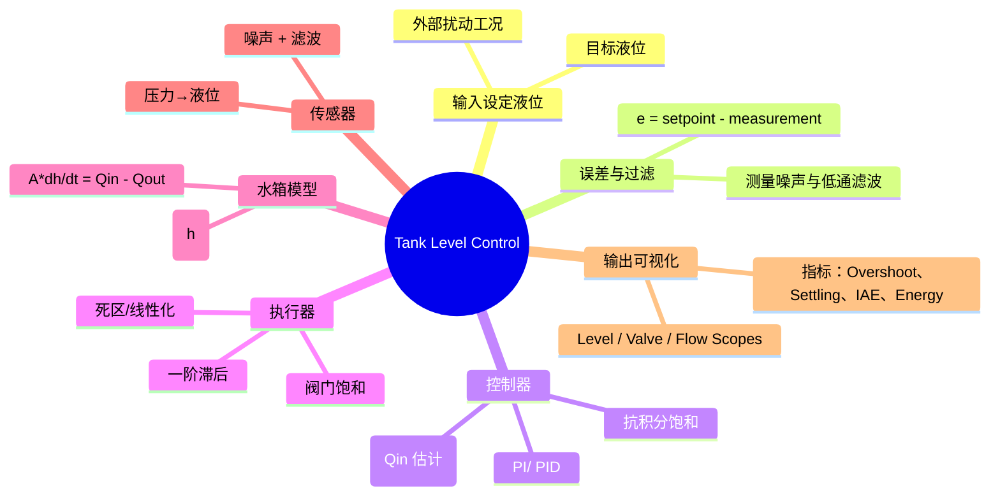

# 水箱液位控制项目（MATLAB + Simulink 全流程指南）

本 README 既是项目主页，也是完整技术报告。它记录了从拿到题目开始的构思、模型假设、代码实现、调参与可视化结果，让没有背景的读者也能一步步搭建同样的系统。

**如何快速运行**
```matlab
% 1. 在 MATLAB 中定位到仓库根目录
addpath(genpath(pwd));

% 2. 运行基于脚本的仿真（输出曲线 + 指标 + tank_level_result）
tank_level_sim;

% 3. 生成并仿真 Simulink 模型（可选）
build_tank_level_model;        % 生成 tank_level_control.slx
build_tank_level_model(true);  % 生成并立即仿真
```
上述步骤即可重现最终图像 `Tank Level Control.png` 与所有性能指标。

---

## 1. 任务总览

| 项目目标 | 说明 |
| --- | --- |
| 被控对象 | 单水箱，截面积 A，液位高度 h |
| 执行器 | 可调出水阀（电动调节阀），控制 `Q_out` |
| 传感器 | 压力传感器折算液位（含噪声、滤波） |
| 控制策略 | PI + feedforward + 抗积分饱和 + 执行器滞后 |
| 仿真平台 | MATLAB 脚本 + 自动生成的 Simulink 模型 |
| 输出成果 | 仿真脚本、Simulink 模型、指标/图像、报告、思维导图 |

**亮点**  
1. **全流程文档化**：`docs/` 中依次提供需求分析、实现指南、详尽报告和思维导图。  
2. **脚本化复现**：`tank_level_sim.m` 与 `build_tank_level_model.m` 确保 MATLAB、Simulink 始终保持一致。  
3. **多轮调优记录**：完整呈现从“第一版”到“最终版”每一步改动及其影响。  
4. **指标可追踪**：仿真自动输出超调、调节时间、IAE、能量等关键数据。  

---

## 2. 系统框架（由手绘到思维导图）

项目初期根据纸面草图梳理出闭环结构：设定值 → 求误差 → PID 控制 → 阀门 → 水箱模型 → 传感器 → 输出。我们将其转换为 Mermaid 思维导图，方便阅读与交流（源文件位于 `docs/system_mindmap.md`）。



---

## 3. 需求与建模假设

| 项目元素 | 假设与说明 |
| --- | --- |
| **水箱模型** | 单自由度：`dh/dt = (Q_in - Q_out)/A`，默认 `A = 0.5 m²`。 |
| **出水阀** | 线性化关系：`Q_out = k_v u √h`，`k_v = 0.7`，`u ∈ [0, 1]`。 |
| **进水** | 基值 `Q_in = 0.12 m³/s`，含阶跃扰动（350~450 s 增加 0.04）与随机噪声 (`σ = 0.001`)。 |
| **测量** | 压力传感器直接输出液位，叠加 2 mm 高斯噪声，通过一阶低通 (`τ = 3.5 s`) 滤波。 |
| **执行器** | 阀门信号经过饱和 → 滞后 (`τ = 1.0 s`) → 死区（默认关闭）。 |
| **控制器** | PI (`Kp = 1.8`, `Ki = 0.12`) + feedforward (`ff_gain = 0.5`) + 抗积分饱和。 |
| **设定值** | 0~200 s 目标 0.5 m，之后阶跃到 0.65 m。 |

如需复用到不同工况，直接修改 `src/tank_level_sim.m` 顶部的参数即可；Simulink 版本会通过 `build_tank_level_model.m` 自动同步。

---

## 4. 实现流程

### 4.1 仓库组织

```
docs/            # 文档、报告、思维导图
src/             # MATLAB/Simulink 脚本
Tank Level Control.png  # 最终响应图
README.md        # 本报告
```

### 4.2 项目结构详解

| 路径/文件 | 主要作用 |
| --- | --- |
| `docs/requirements_analysis.md` | 记录初始需求点、变量与执行器约束、扰动/安全考虑，并评估项目难度；用于理解题目背景与轻量化实现路径。 |
| `docs/lightweight_solution.md` | 详细说明简化模型假设、控制策略、仿真脚本参数、Simulink 子系统组成及使用步骤，调参时优先参考。 |
| `docs/final_report.md` | 全面报告：题目理解、模型搭建、关键优化阶段（含参数表）、最终指标、扩展方向。可直接作为课程项目文档。 |
| `docs/system_mindmap.md` | Mermaid 思维导图，呈现闭环结构（设定→控制→执行→水箱→测量→输出）；源自纸质草图，便于快速理解系统架构。 |
| `src/tank_level_sim.m` | MATLAB 主仿真脚本。包含参数设定、信号生成、控制律实现、执行器/水箱模型、指标计算、图形输出及结果结构化存储。 |
| `src/build_tank_level_model.m` | 通过脚本 API 自动创建 `tank_level_control.slx` 并可选运行仿真。确保 Simulink 模型与 MATLAB 脚本参数完全一致。 |
| `Tank Level Control.png` | 运行 `tank_level_sim` 得到的最终三联图（液位、阀门、功率），可直接插入报告或演示文稿。 |
| `README.md` | 当前文档，整合操作指南、实现细节、调参记录与结果展示，供新读者快速掌握项目。 |

### 4.3 MATLAB 仿真脚本（`src/tank_level_sim.m`）

**关键结构**  
1. **参数定义与信号生成**  
   ```matlab
   params.A = 0.5; params.kv = 0.7;
   params.q_in_base = 0.12;
   ctrl.Kp = 1.8; ctrl.Ki = 0.12;
   ctrl.enable_feedforward = true; ctrl.ff_gain = 0.5;
   filter.tau = 3.5; actuator.tau = 1.0;
   ```
   - 设定值 `setpoint`：200 s 阶跃；扰动 `disturbance`：350~450 s 加流量。
   - 随机噪声通过 `randn` 注入，`rng(0)` 提供可复现性。

2. **控制器核心**  
   ```matlab
   measurement_filt(k) = measurement_filt(k-1) + alpha * ...
   error = measurement_filt(k) - setpoint(k);
   integral_term = integral_term + error * dt;
   u_ff = ctrl.ff_gain * params.q_in_base / (params.kv*sqrt(desired_head));
   raw_u = u_ff + ctrl.Kp * error + ctrl.Ki * integral_term;
   u_cmd(k) = min(max(raw_u, ctrl.u_min), ctrl.u_max);
   if raw_u ~= u_cmd(k)
       integral_term = integral_term - error * dt; % 抗积分饱和
   end
   ```
   - 滤波后的测量值参与误差计算，避免噪声引发阀门抖动。  
   - feedforward 估算稳态阀门开度，降低设定值变化带来的偏差。  
   - 抗积分饱和：当 `raw_u` 超出饱和限制时，撤销积分增量。

3. **执行器与水箱更新**  
   ```matlab
   u_act(k) = u_act(k-1) + (dt/actuator.tau) * (u_cmd(k) - u_act(k-1));
   qin_history(k) = params.q_in_base + disturbance(k) + params.q_in_noise_std * randn;
   q_out = params.kv * u_act(k) * sqrt(max(h(k-1), 0));
   h(k) = max(h(k-1) + (qin_history(k) - q_out)/params.A * dt, 0);
   ```
   - 执行器被建模为一阶滞后，反映阀门惯性。  
   - 水箱液位通过欧拉积分更新。  
   - 可选死区在目前版本关闭，如需加入只要恢复相应代码即可。

4. **指标输出**  
   ```matlab
   overshoot = max(h) - final_setpoint;
   iae = trapz(time, abs(h - setpoint));
   control_energy = trapz(time, u_act.^2);
   ```
   - 自动打印：最终液位、超调、调节时间、IAE、阀门平均/能量。  
   - 结果保存至 `tank_level_result` 结构，便于作图、导出或写报告。

5. **可视化**  
   - 3 行子图：液位/设定值/滤波测量、控制器/执行器/有效开度、功率 vs. 进水扰动。  
   - 最终图像另存为 `Tank Level Control.png`（位于仓库根目录）。

### 4.4 Simulink 自动建模（`src/build_tank_level_model.m`）

我们使用脚本调用 Simulink API 来创建 `tank_level_control.slx`：  

1. **建立模型与参数**  
   ```matlab
   new_system(model);
   set_param(model, 'StopTime', '600', 'Solver', 'ode45');
   add_block('simulink/Sources/Step', ...); % Setpoint/Disturbance
   ```
2. **控制链路**  
   - `Setpoint → InvSqrt → FFGain → FFProduct` 提供 feedforward。  
   - `PI_Controller`（PID block 配 PI），与 feedforward 在 `ControlSum` 汇合，再经过 `ValveSaturation → ActuatorLag → DeadbandMap`。  
3. **水箱与测量**  
   - `LevelIntegrator` + `Math Function(sqrt)` 表示 `√h`。  
   - `Random Number + Gain` 注入测量噪声，`LevelFilter` 作为低通。  
4. **Scope/Mux**  
   - `LevelScope` 显示设定值/测量，`ValveScope` 显示控制器/执行器/有效开度，`FlowScope` 显示进水总量与噪声。  
5. **仿真与输出**  
   - `build_tank_level_model(true)` 会调用 `sim(model)` 并将结果保存为 `tank_level_simout`。  

若在 GUI 中手动编辑 `.slx`，可以随时重新运行脚本以恢复标准配置。

---

## 5. 演进与调参记录

| 阶段 | 参数 (Kp/Ki/ff/滤波/滞后) | 现象 | 问题 & 调整 |
| --- | --- | --- | --- |
| **初版** | 4.5 / 0.25 / 无 / 无 / 无 | 极快响应但超调 >0.3 m，噪声带来剧烈抖动 | 加入低通 + 阀门饱和，超调下降但仍震荡 |
| **迭代 I** | 3.4 / 0.22 / 0.9 / 3.5 s / 0.6 s | 子系统更稳但 feedforward 偏大，仍有 0.2 m 余振 | 调低进水噪声、缩小死区、调慢滤波 |
| **迭代 II** | 2.5 / 0.12 / 关 / 4.5 s / 0.8 s | 非常平稳但调节时间长 | 再次启用 feedforward，寻找中庸点 |
| **最终版** | **1.8 / 0.12 / 0.5 / 3.5 s / 1.0 s** | 余振约 0.1 m，200 s 内进入 ±0.02 m，扰动可快速恢复 | 被选为最终报告/图表 |

调优思路：  
1. 先用较大 Kp/Ki 获得快速响应，再逐步减小以抑制余振。  
2. feedforward 由 0→0.9→0.5，证明“适度前馈”可兼顾稳态精度与稳定性。  
3. 加重滤波/执行器滞后是控制阀门抖动的关键。  
4. 随机扰动越强，`filter.tau` 与 `Kp` 越需要下调以避免激励噪声。

---

## 6. 仿真结果


**解读**  
- 第一行：液位（蓝）、设定值（橙虚线）、滤波测量（黄点）；可以看到阶跃后最大超调约 0.1 m，之后呈指数衰减。  
- 第二行：控制器输出、执行器输出（滞后）与有效开度几乎重合，说明动态建模合理。  
- 第三行：控制功率 proxy (`u²`) 与进水噪声，进水扰动阶段功率上升，扰动解除后逐渐回落。  

**指标示例**（运行 `tank_level_sim` 的终端输出）：  
```
最终液位 0.652 m，阀门有效开度 22.6%。
指标：超调 0.10 m，调节时间 210 s，IAE 24.8，
      平均阀门 22.1%，能量 30.2。
```

---

## 7. 操作指南

1. **准备环境**：安装 MATLAB + Simulink（需含 JVM）。若 `build_tank_level_model` 报 “Java is not enabled”，请参考 `docs/final_report.md` 附录修复 JVM/环境变量。
2. **运行脚本**：
   ```matlab
   addpath(genpath(pwd));
   tank_level_sim;           % 查看图像与指标
   build_tank_level_model;   % 生成 .slx
   build_tank_level_model(true); % 生成 + 仿真
   ```
3. **修改参数**：直接编辑 `tank_level_sim.m` 顶部结构体（或在脚本中添加新场景），再执行 `build_tank_level_model` 以同步到 Simulink。
4. **导出数据**：使用 `tank_level_result` 中的字段（`level`, `u_act`, `qin`, `metrics` 等）生成 CSV/LaTeX 表格，或写进报告。  
5. **调试建议**：若出现发散/波形异常，先降低 `Kp`、增大 `filter.tau`、或关闭 feedforward；确保噪声强度与滤波器匹配。

---

## 8. 扩展方向

1. **批量仿真/整定**：编写脚本循环不同 `Kp/Ki/ff_gain`，对 `tank_level_result.metrics` 进行统计，对应课程中的参数敏感性分析。  
2. **高级控制**：在 MATLAB 中实现 MPC/模糊控制，并在 Simulink 中替换 `PI_Controller` block。  
3. **故障仿真**：加入 `Transport Delay`、`Sensor Bias`、`Actuator Saturation` 等模块，验证鲁棒性。  
4. **硬件映射**：利用 Simulink Coder 或 Simulink Real-Time，将模型移植到嵌入式目标（例如 Arduino、PLC）。  
5. **报告生成**：基于 `docs/final_report.md` 的结构，将 `tank_level_result` 数据自动嵌入表格/图形，形成 PDF/Slides。  

---

## 9. 文档索引（进一步阅读）

| 文件 | 内容简介 |
| --- | --- |
| `docs/requirements_analysis.md` | 项目背景、需求拆分、轻量化方案、难度评估。 |
| `docs/lightweight_solution.md` | 参数说明、脚本/Simulink 操作步骤、调参建议。 |
| `docs/final_report.md` | 完整报告（含关键优化点、指标表、结论）。 |
| `docs/system_mindmap.md` | 思维导图源文件，可直接复制到支持 Mermaid 的编辑器预览。 |

---

## 10. 关键代码摘要

> 下面列出项目中最具代表性的片段，帮助读者快速抓住实现要点。

1. **PI + Feedforward + 抗积分饱和**
   ```matlab
   error = measurement_filt(k) - setpoint(k);
   integral_term = integral_term + error * dt;
   if ctrl.enable_feedforward
       u_ff = ctrl.ff_gain * params.q_in_base / ...
              max(params.kv * sqrt(desired_head), 1e-4);
   else
       u_ff = 0;
   end
   raw_u = u_ff + ctrl.Kp * error + ctrl.Ki * integral_term;
   u_cmd(k) = min(max(raw_u, 0), 1);
   if raw_u ~= u_cmd(k)
       integral_term = integral_term - error * dt; % anti-windup
   end
   ```

2. **执行器滞后与水箱积分**
   ```matlab
   u_act(k) = u_act(k-1) + (dt/actuator.tau) * (u_cmd(k) - u_act(k-1));
   q_in = params.q_in_base + disturbance(k) + params.q_in_noise_std * randn;
   q_out = params.kv * u_act(k) * sqrt(max(h(k-1), 0));
   h(k) = max(h(k-1) + (q_in - q_out)/params.A * dt, 0);
   ```

3. **指标计算与结果存储**
   ```matlab
   overshoot = max(h) - final_setpoint;
   iae = trapz(time, abs(h - setpoint));
   settling_time = find_first(time, abs(h - setpoint) < 0.01);
   tank_level_result = struct('time', time, 'level', h, ...
       'setpoint', setpoint, 'u_act', u_act, 'metrics', struct(...));
   ```

4. **Simulink Feedforward 构建**
   ```matlab
   add_block('simulink/User-Defined Functions/Fcn', blk('InvSqrt'), 'Expr', '1/sqrt(u+1e-4)');
   add_block('simulink/Sources/Constant', blk('FFGain'), 'Value', num2str(ctrl.ff_gain * params.q_in_base / params.kv));
   add_block('simulink/Math Operations/Product', blk('FFProduct'));
   add_line(model, 'Setpoint/1', 'InvSqrt/1');
   add_line(model, 'InvSqrt/1', 'FFProduct/2');
   add_line(model, 'FFGain/1', 'FFProduct/1');
   add_line(model, 'FFProduct/1', 'ControlSum/2');
   ```

这些片段与 README 前文互相呼应，帮助读者迅速定位和理解核心实现。

---
