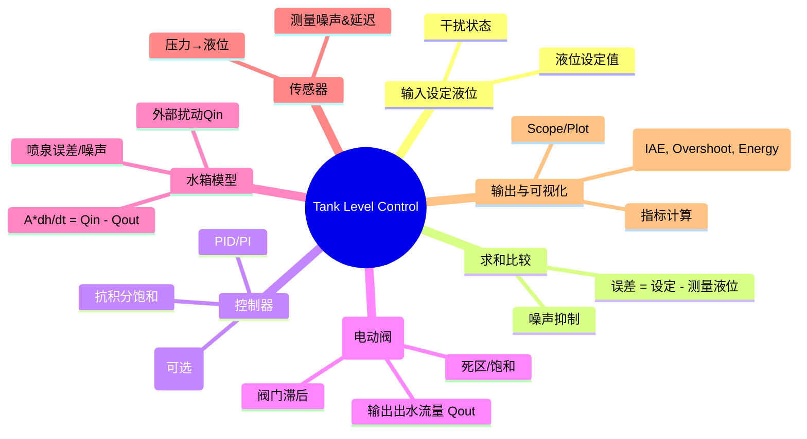

# 水箱液位控制思维导图

```mermaid
mindmap
  root((Tank Level Control))
    输入设定液位
      液位设定值
      干扰状态
    求和比较
      误差 = 设定 - 测量液位
      噪声抑制
    控制器
      PID/PI
      抗积分饱和
      前馈(可选)
    执行器(电动阀)
      阀门滞后
      死区/饱和
      输出出水流量 Qout
    水箱模型
      A*dh/dt = Qin - Qout
      外部扰动Qin
      喷泉误差/噪声
    传感器
      压力→液位
      测量噪声&延迟
    输出与可视化
      Scope/Plot
      指标计算
      报表(IAE, Overshoot, Energy)
```

> 使用方法：在 Markdown 预览或支持 Mermaid 的环境中查看，即可获得与手绘图一致的框架结构。
